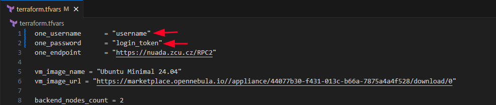
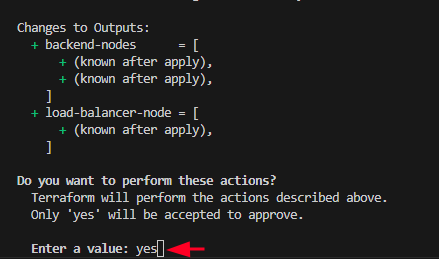
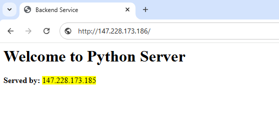
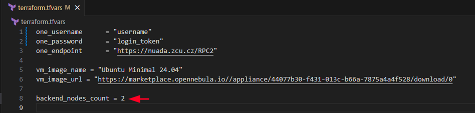

# DCE-Semestralka_1
The first semester thesis from the subject KIV/DCE is devoted to the implementation of cloud infrastructure with a load-balancer and several backends. The infrastructure is implemented with these listed tools: Docker, Terraform, Ansible. Furthermore, this work uses the OpenNebula cloud services provided by University of West Bohemia at nuada.zcu.cz.

## Function
The resulting cluster returns a simple web page containing the IP address of the serving backend when accessing the load balancer's address. The backend is written using Python Flask module. The load balancer utilizes round-robin algorithm for purposes of transparency.

## Usage
1. Install Docker, Terraform and Ansible.
2. Clone the git repository: `git clone --recursive https://github.com/ZdenekVavricka/dce-semestralka_1.git` into your desire location.
3. In `terraform.tfvars`, change the username(`one_username`) and login token (`one_password`) to valid values

  

   
5. Initialize Terraform: `terraform init`
6. Apply the infrastructure: `terraform apply` -> `yes`

  

  
6. Run the Ansible playbook: `ansible-playbook -i dynamic_inventories/cluster ansible/main-cluster.yml`
7. Connect to `http://<load-balancer-ip>`

  

**Note**: 
- *Number of backend servers can be changed using the backend_nodes_count variable in terraform.tfvars*
  

  

- *If you want delete virtual machines using Terraform:* `terraform destroy` -> `yes`

---

It was created for the purposes of the KIV/DCE course at the University of West Bohemia. 
